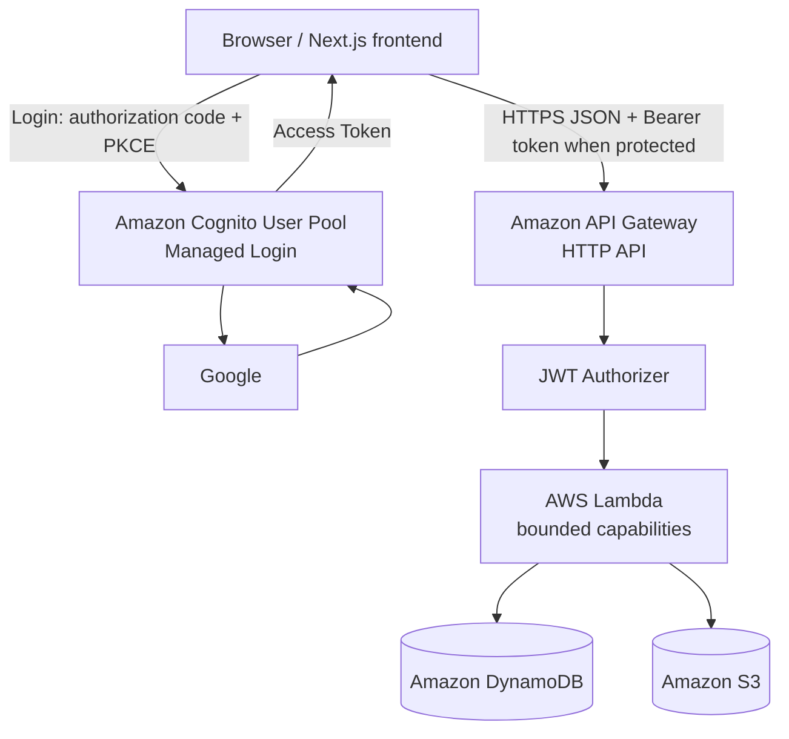
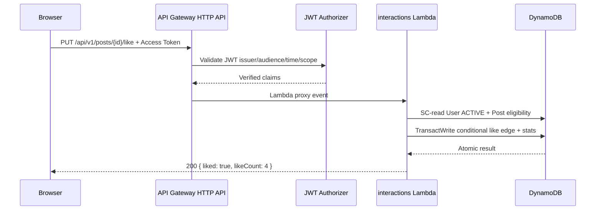

# API design V1

## Purpose and status

Tài liệu này là source of truth cho HTTP contract V1 giữa Next.js frontend và AWS backend của Khanh Phan AWS Learning Journal.

- `docs/DATA_MODEL.md` sở hữu business/domain semantics và invariants.
- `docs/DYNAMODB_DESIGN.md` sở hữu persistence keys, indexes, transactions và consistency.
- `docs/API_DESIGN.md` sở hữu routes, auth classes, request/response DTOs, validation và HTTP behavior.
- Repository hiện vẫn là frontend prototype dùng mock data. Tài liệu này không khẳng định API, Lambda, API Gateway, Cognito, DynamoDB hoặc S3 resource nào đã được triển khai.
- Practice API chưa thuộc V1 vì Practice domain vẫn preliminary.

API convenience không được silently thay đổi content lifecycle, exact-locale public rule, authorization authority hoặc DynamoDB invariants.

## Architecture decision

V1 dùng Amazon API Gateway **HTTP API**, không dùng API Gateway REST API và không dùng Next.js Route Handlers làm backend chính.



Responsibilities:

| Layer | Owns | Does not own |
| --- | --- | --- |
| Next.js | UI, locale-aware navigation, API client, Cognito login/token handling | Business authorization, DynamoDB/S3 direct access |
| API Gateway HTTP API | HTTP method/path routing, JWT authorizer attachment, CORS, stage/environment, service request limits, basic throttling, access logs/metrics, Lambda proxy integration | Domain validation, DynamoDB transactions, ADMIN group/status decision, publication invariants, comment-parent checks, idempotency state, S3 content lifecycle |
| Lambda | Request validation, application/business logic, ADMIN authorization, DTO mapping, cursor signing, idempotency orchestration, DynamoDB/S3 coordination | Authentication UI, durable binary storage |
| DynamoDB | Structured source records, indexes, materialized projections, relations and counters | Markdown body or binary media |
| S3 | Markdown body and media objects | Domain state or authorization decisions |
| Cognito User Pool | Google federation, authentication, tokens and identity lifecycle | Application `User.status`, content ownership or full ADMIN authorization |

HTTP API is the public HTTP entry point; Lambda is the backend compute/application layer. Browser code never receives AWS credentials and never calls DynamoDB directly. A presigned S3 upload is a narrow, temporary delegated operation, not general privileged S3 access.

### HTTP API versus REST API ADR

HTTP API provides the V1 needs—Lambda proxy integration, routing, native JWT authorizer and CORS—with lower configuration and cost surface. REST API features such as usage plans/API keys, built-in caching, VTL transforms and REST-specific request validation are not required. Revisit REST API only when a proven requirement cannot be met safely by HTTP API.

HTTP API currently has a 10 MB payload quota and a 30-second maximum integration timeout. Application limits below are intentionally smaller. Large binary payloads bypass API Gateway/Lambda through presigned S3 upload.

## Base conventions

| Concern | V1 contract |
| --- | --- |
| Base path | `/api/v1` |
| Future custom domain | `https://api.<domain>/api/v1`; not deployed in this phase |
| Content type | `application/json; charset=utf-8` |
| Encoding | UTF-8 |
| Locale | Strict lowercase enum `vi` or `en` |
| Timestamp | ISO 8601 UTC instant |
| IDs | Opaque strings; clients must not parse them |
| Pagination | Cursor only; no offset or page number |
| Unknown JSON fields | Rejected on mutation requests in V1 |
| API DTO | Stable HTTP projection; never a DynamoDB item |

Breaking response/request changes require a future `/api/v2`. Additive optional fields may remain in V1 when old clients can safely ignore them. Existing field meaning, enum meaning and requiredness must not change incompatibly inside V1.

## Authentication and authorization

### Login and token contract

There is no custom `/login`, `/signup` or token API. Browser login uses Cognito Managed Login with Google through the OAuth 2.0 authorization-code flow with PKCE. The browser app client is public and has no client secret.

Protected requests send:

```http
Authorization: Bearer <Cognito Access Token>
```

The HTTP API JWT authorizer is configured with:

- issuer `https://cognito-idp.<region>.amazonaws.com/<userPoolId>`;
- audience equal to the Cognito App Client ID;
- identity source `$request.header.Authorization`;
- a V1 API authorization scope such as `aws-learning-journal/access` on every AUTHENTICATED and ADMIN route.

API Gateway validates signature/key, `iss`, `aud` or—when `aud` is absent—`client_id`, `exp`, `nbf`, `iat`, and the configured route scope. Requiring an authorization scope prevents an ID Token, which has no access-token scope, from being accepted as the API credential. Lambda additionally requires `token_use = access` before using forwarded claims; it does not reimplement cryptographic JWT verification already completed by the authorizer.

### Route classes

| Class | Gateway | Lambda/application |
| --- | --- | --- |
| PUBLIC | No token required | Validate all input; never infer identity from unverified headers/body |
| AUTHENTICATED | JWT authorizer + required V1 access scope | Require `token_use=access`, map `sub` to application User; `/me` may return current status, while every other protected route requires `User.status=ACTIVE` |
| ADMIN | Same JWT authorizer/scope | Require `cognito:groups` contains `ADMIN`, SC-read User META and require current `User.status=ACTIVE` |

`User.role` is a UI/admin-listing projection only. `User.role=ADMIN` alone never authorizes. API Gateway JWT validation does not enforce `cognito:groups` or the current DynamoDB status; those remain Lambda responsibilities.

- `401 Unauthorized`: missing, malformed, expired, wrong-issuer/audience/scope or otherwise invalid Access Token.
- `403 Forbidden`: authenticated caller lacks ADMIN group, has non-ACTIVE application status, or cannot perform the requested action.

HTTP API may emit a gateway-native body for a request rejected before Lambda. Lambda-originated errors always use the standard envelope below. The frontend API client normalizes gateway-native `401`/`429` responses to `TOKEN_INVALID`/`RATE_LIMITED`; the wire contract must not falsely promise Lambda's JSON envelope when Lambda was never invoked.

### User bootstrap

V1 chooses lazy, idempotent bootstrap on the first authenticated application request; no explicit bootstrap endpoint is added. The shared auth layer:

1. Reads `COGNITO#<sub>/USER` strongly consistently (AP17).
2. If absent, retrieves verified profile attributes from Cognito using the verified token username/sub context; it never trusts email/display name from the request body.
3. Conditionally transacts Cognito-sub sentinel, normalized-email sentinel and User META.
4. On a retry, returns the existing matching User. A conflicting email mapping is not silently merged.

`GET /me` is the normal frontend call immediately after login and returns the bootstrapped User. Other protected handlers use the same shared ensure-user behavior so call ordering is not a security assumption. `cognitoSub` is never returned to the frontend.

## Lambda grouping

V1 uses one Lambda per bounded capability:

| Lambda group | Route ownership | IAM direction |
| --- | --- | --- |
| `public-content` | Public Post, Topic and Series reads | Read public/source projections and approved S3 body/media |
| `user-profile` | `/me` and bootstrap | Cognito profile lookup plus scoped User/sentinel reads/writes |
| `interactions` | Comments, likes, bookmarks, shares and views | Interaction/source/counter items; read Post eligibility |
| `admin-content` | Admin Post/translation/lifecycle, Topic, Series and upload routes | Scoped content writes, DynamoDB transactions and S3 object/presign access |

One function per endpoint gives the strongest IAM and deployment isolation but creates too many packages, roles and alarms for a personal blog. One giant Lambda is simpler initially but couples public, interaction and privileged admin code/IAM. Four bounded functions keep ownership and testing clear without micro-function operational overhead. Shared libraries may hold DTO validation, errors, auth context, cursor codec and logging, but handlers remain capability-specific.

## Standard HTTP responses

Successful list:

```json
{
  "items": [],
  "nextCursor": null
}
```

Single-resource responses use a resource-specific top-level property such as `post`, `user`, `series` or `comment`. Mutation responses return only the updated client-relevant state.

All Lambda-originated errors use:

```json
{
  "error": {
    "code": "POST_NOT_FOUND",
    "message": "Post not found",
    "requestId": "01J..."
  }
}
```

Responses never expose DynamoDB `PK`/`SK`, raw `LastEvaluatedKey`, stack traces, internal exceptions, JWTs, sensitive claims, viewer digests, presigned URL query strings in logs, or raw S3 keys on public DTOs.

### Error taxonomy

| HTTP | Codes | Meaning |
| ---: | --- | --- |
| 400 | `VALIDATION_ERROR`, `INVALID_COMMENT_PARENT` | Syntax, bounds, enum, cursor context or parent rule invalid |
| 401 | `AUTH_REQUIRED`, `TOKEN_INVALID` | Missing or invalid authentication; gateway rejection may use native body |
| 403 | `FORBIDDEN`, `POST_NOT_PUBLIC` | Authenticated but unauthorized, inactive, or requested Post is inaccessible for the operation |
| 404 | `POST_NOT_FOUND`, `TRANSLATION_NOT_AVAILABLE`, `TOPIC_NOT_FOUND`, `SERIES_NOT_FOUND`, `COMMENT_NOT_FOUND` | Resource or exact-locale public representation unavailable |
| 409 | `SLUG_CONFLICT`, `STALE_VERSION`, `INVALID_STATE_TRANSITION`, `INVALID_RESOURCE_TYPE`, `IDEMPOTENCY_KEY_REUSED`, `POSITION_CONFLICT`, `FANOUT_LIMIT_EXCEEDED`, `ACCOUNT_LINK_REQUIRED` | Current state conflicts with requested mutation |
| 429 | `RATE_LIMITED` | Gateway/application throttle |
| 500 | `INTERNAL_ERROR` | Unexpected backend failure; details only in controlled logs |
| 503 | `DEPENDENCY_UNAVAILABLE` | DynamoDB, S3 or Cognito temporarily unavailable after bounded retries |

Public read routes deliberately collapse non-public, missing and wrong-locale representations to a public-safe `404`; `POST_NOT_PUBLIC` is reserved for an authenticated mutation whose caller may safely be told that the known Post is not interactable.

V1 uses `409 Conflict` for `STALE_VERSION` because concurrency is expressed as JSON `expectedVersion`, not an HTTP `If-Match` precondition. `412` is reserved for a future ETag/`If-Match` contract. Domain errors never return `200`.

## Cursor pagination

- General list default is `limit=20`; maximum is `50`.
- `GET /posts` defaults to `12` for the current homepage/recent-list shape, maximum `50`.
- `GET /topics` defaults to `50`, maximum `100`, because the V1 catalog is small.
- Limit must be a positive integer. The backend may return fewer items without implying end-of-data; only `nextCursor=null` means complete.
- Cursor is a base64url-encoded, versioned server payload protected by HMAC. It contains the DynamoDB LEK internally but never exposes a raw LEK structure.
- Cursor is bound to endpoint, authenticated subject where relevant, locale, filters, sort direction and effective limit. Reuse in another context returns `400 VALIDATION_ERROR`.
- Cursor secrets remain server-side and rotate through environment configuration; the API supports the current and immediately previous signing key during controlled rotation.

Request:

```http
GET /api/v1/posts?locale=vi&limit=12&cursor=<opaque>
```

Response:

```json
{
  "items": [],
  "nextCursor": "v1.opaque-or-null"
}
```

Sort direction follows `DYNAMODB_DESIGN.md`: AP02/AP03/AP10/AP15/AP16/AP20 newest-first; AP04/AP05 position ascending; AP06/AP07 created-at ascending; AP21 Topic sort order ascending. Bookmark pagination preserves the documented fill-loop cursor at the last consumed edge.

## Response DTOs

DTOs are API projections, not DynamoDB item shapes. `coverUrl`, `iconUrl` and `avatarUrl` are frontend-ready HTTPS delivery URLs; they may be CDN or short-lived read URLs, must not be persisted by the client, and never reveal storage keys.

```text
PostStatsDTO {
  viewCount: non-negative integer
  likeCount: non-negative integer
  commentCount: non-negative integer
  shareCount: non-negative integer
}

PostSummaryDTO {
  id: string
  slug: string
  type: JOURNAL | NOTE | LAB
  title: string
  excerpt: string
  coverUrl: string | null
  readingMinutes: non-negative integer | null
  publishedAt: ISO-8601 UTC string
  stats?: PostStatsDTO
}

PostDetailDTO extends PostSummaryDTO {
  content: { format: MARKDOWN, markdown: string }
  topics: TopicSummaryDTO[]
  stats: PostStatsDTO
  lab: LabMetadataDTO | null
}

LabMetadataDTO {
  difficulty: INTRO | INTERMEDIATE
  labStatus: COMPLETE | REVISIT | PLANNED
  services: string[]
}

AdminLabMetadataDTO extends LabMetadataDTO {
  version: positive integer
}

TopicSummaryDTO {
  id: string
  slug: string
  name: string
  iconUrl: string | null
  sortOrder: integer
}

SeriesSummaryDTO {
  id: string
  slug: string
  title: string
  description: string
  coverUrl: string | null
}

SeriesPostSummaryDTO {
  position: positive integer
  post: PostSummaryDTO
}

CommentDTO {
  id: string
  postId: string
  parentId: string | null
  content: string | null
  status: VISIBLE | PENDING | DELETED
  author: { id: string, displayName: string, avatarUrl: string | null }
  createdAt: ISO-8601 UTC string
  updatedAt: ISO-8601 UTC string
}

UserDTO {
  id: string
  email: string
  displayName: string
  avatarUrl: string | null
  role: USER | ADMIN
  status: ACTIVE | BANNED
}

BookmarkSummaryDTO {
  savedAt: ISO-8601 UTC string
  post: PostSummaryDTO
}
```

Public comment lists contain VISIBLE comments and sanitized DELETED tombstones only when needed to preserve thread shape; tombstones have `content=null` and no private author details. `PENDING` is returned only to its creator immediately after creation if that policy is enabled later.

## Public content API

All public content reads enforce exact-locale eligibility. There is no VI ↔ EN body fallback.

### GET `/api/v1/posts/{slug}`

AP01. Query: required `locale`.

Backend path: Post slug sentinel → Post META → exact PostTranslation → PostStats → optional `POST#<postId>/LAB_METADATA` direct read → PostTopic/Topic → S3 Markdown body. It requires Post `PUBLISHED`, `PUBLIC` and exact translation `READY`; the LabMetadata read is included in the existing Post-collection BatchGet when `postType=LAB`.

```json
{
  "post": {
    "id": "p_123",
    "slug": "dynamodb-consistency",
    "type": "NOTE",
    "title": "DynamoDB consistency bằng ngôn ngữ đơn giản",
    "excerpt": "Điều eventual và strongly consistent read đảm bảo.",
    "content": { "format": "MARKDOWN", "markdown": "# ..." },
    "readingMinutes": 5,
    "publishedAt": "2026-09-09T01:00:00.000Z",
    "coverUrl": "https://media.example/...",
    "topics": [],
    "stats": { "viewCount": 42, "likeCount": 3, "commentCount": 2, "shareCount": 1 },
    "lab": null
  }
}
```

For `Post.type=LAB`, `lab` contains the required `LabMetadataDTO`. For JOURNAL/NOTE, `lab=null`. A published LAB missing LabMetadata is an integrity error and is not silently represented as a non-Lab Post. Lab metadata remains detail-only: it is not duplicated into Post list, Topic or Series projections, so this read adds no GSI, Scan or global access pattern.

Unknown slug returns `POST_NOT_FOUND`. Existing Post without an eligible requested locale returns `TRANSLATION_NOT_AVAILABLE`; private/archived state is not disclosed beyond a public-safe `404` response.

### GET `/api/v1/posts`

AP02 and AP20 share one endpoint. Query: required `locale`; optional `limit`, `cursor`, and `includeStats=true|false` (default `false`). `includeStats=true` supports the homepage through the bounded BatchGet described by AP20; no `/homepage/posts` route exists.

The backend queries `GSI1_PUBLISHED` at `PUBLISHED#<locale>` newest-first with no FilterExpression. Each item is a `PostSummaryDTO`; stats are optional only when requested. Response uses the standard list envelope.

### GET `/api/v1/topics`

AP21. Query: required `locale`; optional `limit`, `cursor`. The backend queries `CATALOG#TOPICS` ascending by zero-padded `sortOrder`, never Scan.

Each item is `TopicSummaryDTO`. V1 does not return `publishedPostCount`; current mock counts are illustrative and the persistence contract deliberately has no counter requirement.

### GET `/api/v1/topics/{slug}/posts`

AP03. Query: required `locale`; optional `limit`, `cursor`. Backend resolves the Topic slug sentinel, then queries `TOPIC#<topicId>#LOCALE#<locale>` newest-first. Results are exact-locale READY public `PostSummaryDTO` items with no Scan or post-query locale fallback.

### GET `/api/v1/series/{slug}`

AP04. Query: required `locale`; optional `limit`, `cursor`. Backend resolves the immutable Series slug, requires Series `PUBLISHED` plus exact `SeriesTranslation READY`, then queries eligible public edges by position ascending.

```json
{
  "series": {
    "id": "s_123",
    "slug": "seven-days-of-aws",
    "title": "Bảy ngày học AWS",
    "description": "...",
    "coverUrl": null
  },
  "posts": [
    { "position": 1, "post": {} }
  ],
  "nextCursor": null
}
```

V1 uses partial exposure: if seven members exist but only five are public/READY in EN, EN returns those five in relative Series position order. It never fills with VI content.

### GET `/api/v1/posts/{postId}/series`

AP05. Query: required `locale`; optional `limit`, `cursor`. Returns exact-locale READY published `SeriesSummaryDTO` items plus member `position`, ordered by Series position. It does not expose draft Series.

AP22 `List Published Series` remains deferred. There is no `GET /api/v1/series` browse endpoint and no API-driven reason to add a GSI/catalog.

### Post stats decision

AP12 is an internal supporting read, not a standalone endpoint in V1. Detail always embeds stats; `/posts?includeStats=true` embeds them for the homepage; interaction mutations return the affected count. This avoids another public call and avoids a post-ID-only endpoint that could leak activity for inaccessible content. Revisit only if live counter refresh becomes a real requirement.

## Current user API

### GET `/api/v1/me`

AUTHENTICATED. Runs lazy bootstrap/AP17 and returns:

```json
{
  "user": {
    "id": "u_123",
    "email": "reader@example.com",
    "displayName": "Reader",
    "avatarUrl": null,
    "role": "USER",
    "status": "ACTIVE"
  }
}
```

Email comes from verified Cognito-owned attributes, not request input. `role` is explicitly a projection for UI; `cognitoSub`, token claims and internal status history are omitted. `/me` is the only protected route allowed to return a mapped `BANNED` User so the frontend can render the account state; all other protected routes return `403 FORBIDDEN` for that User.

### GET `/api/v1/posts/{postId}/me-state`

AUTHENTICATED. Query: required `locale`. Combines AP08 and AP11 using strongly consistent direct item reads after checking that the exact-locale Post is accessible.

```json
{
  "liked": true,
  "bookmarked": false
}
```

This replaces separate GET-like-state and GET-bookmark-state endpoints.

### GET `/api/v1/me/bookmarks`

AUTHENTICATED, AP10. Query: required `locale`; optional `limit`, `cursor`. Returns `BookmarkSummaryDTO` newest-first through the documented fill loop. A bookmark edge may remain when content becomes archived/private, but the listing does not expose inaccessible or wrong-locale content.

## Interaction API

All authenticated interaction mutations derive `userId` from verified claims/User mapping and require current `User.status=ACTIVE`. They ignore/reject client-supplied identity fields.

### Like

```http
PUT /api/v1/posts/{postId}/like?locale=vi
DELETE /api/v1/posts/{postId}/like?locale=vi
```

AUTHENTICATED, AP09. Both validate exact-locale Post access and map to the existing edge + PostStats transaction.

```json
{ "liked": true, "likeCount": 4 }
```

```json
{ "liked": false, "likeCount": 3 }
```

PUT is desired-state idempotent: a repeated PUT returns `liked=true` without another increment. DELETE behaves symmetrically. There is no toggle endpoint.

### Bookmark

```http
PUT /api/v1/posts/{postId}/bookmark?locale=vi
DELETE /api/v1/posts/{postId}/bookmark?locale=vi
```

AUTHENTICATED, AP10/AP11. PUT creates the direct lookup and chronological edge conditionally; DELETE removes both using the stored `createdAt`. Retries do not duplicate or skip counter effects (Bookmark has no counter).

```json
{ "bookmarked": true }
```

### Comments

```http
GET /api/v1/posts/{postId}/comments?locale=vi&limit=20&cursor=...
GET /api/v1/posts/{postId}/comments/{commentId}/replies?locale=vi&limit=20&cursor=...
POST /api/v1/posts/{postId}/comments?locale=vi
```

GET routes are PUBLIC and map to AP06/AP07 after validating exact-locale Post access. Root comments and direct replies are separate cursor streams ordered by creation time ascending.

POST is AUTHENTICATED and requires `Idempotency-Key`.

Root body:

```json
{ "content": "A useful comment." }
```

Reply body:

```json
{ "parentId": "c_123", "content": "A direct reply." }
```

Lambda trims/validates content and enforces: parent exists, same Post, parent has no parent, maximum depth is one, and target Post is exact-locale public. Invalid parent returns `400 INVALID_COMMENT_PARENT`; reply-to-reply is never silently flattened.

V1 accepts new comments as `VISIBLE` immediately because the current product has authenticated comments but no moderation queue UI/workflow. The transaction writes Comment source/public edge and increments PostStats once. The creator response contains `comment.status=VISIBLE`. PENDING remains a domain state reserved for a future moderation policy; adding it requires an admin moderation API decision.

### Share

```http
POST /api/v1/posts/{postId}/shares?locale=vi
Idempotency-Key: <opaque-client-generated-id>
```

PUBLIC, AP14. V1 records shares anonymously even when the browser also has a session; this avoids optional authentication ambiguity on one HTTP API route. Body:

```json
{ "platform": "COPY_LINK" }
```

Allowed values are `FACEBOOK`, `X`, `LINKEDIN`, `COPY_LINK`, `OTHER`. The key maps to the durable share-event identity; retrying the same key and payload returns the original logical result without another event/count. Reusing it with a different Post/platform returns `409 IDEMPOTENCY_KEY_REUSED`.

```json
{ "accepted": true, "shareCount": 3 }
```

### View

```http
POST /api/v1/posts/{postId}/views?locale=vi
```

PUBLIC, AP13. Client cannot send `viewerId`, `viewerDigest`, raw IP identity or counter delta. Lambda/API owns an opaque first-party viewer cookie and derives the HMAC digest used by the existing one-hour dedup transaction.

Production cookie contract: random high-entropy value, `HttpOnly`, `Secure`, `SameSite=Lax`, API-host scoped and no long-term raw IP retention. This V1 strategy assumes frontend and API share the same registrable site—for example `https://example.com` and `https://api.example.com` are separate origins but same-site. Frontend requests include credentials; CORS therefore uses exact origins. Cookie loss, another browser and bot traffic mean this is a UX view counter, not unique-human analytics.

A browser calling an unrelated `https://<api-id>.execute-api.<region>.amazonaws.com` origin is cross-site; V1 must not assume its `SameSite=Lax` cookie is sent on fetch. Production should expose the API through a same-site custom domain or same-site CloudFront routing. A deployment that intentionally remains cross-site must separately review `SameSite=None; Secure`, exact credentialed CORS and privacy implications; this document does not switch V1 to `SameSite=None` automatically. Local development may use environment-specific same-site proxy/domain handling or accept that view dedup is not representative until that path is configured.

```json
{ "accepted": true, "viewCount": 123 }
```

A duplicate inside the dedup window returns `accepted=false` and the current display count without incrementing either aggregate. No viewer digest is returned.

## Admin content API

Every route in this section is ADMIN: HTTP API JWT authorizer plus V1 access scope, `token_use=access`, `cognito:groups` contains `ADMIN`, and a strongly consistent `User.status=ACTIVE` check. Normal admin clients cannot supply `authorId`, `userId`, ADMIN flags or role; actor/author identity comes from the verified application User.

### Admin Post reads and metadata

```http
GET /api/v1/admin/posts?status=DRAFT&locale=vi&limit=20&cursor=...
GET /api/v1/admin/posts/{postId}?locale=vi
POST /api/v1/admin/posts
PATCH /api/v1/admin/posts/{postId}
```

List maps AP15/AP16 to `GSI2_POST_STATUS`; it is eventually consistent and never used as mutation or authorization truth. Detail strongly reads Post META plus requested translation for editing and returns `lab: AdminLabMetadataDTO | null` from the direct `LAB_METADATA` item when the Post is LAB, so the editor receives its current version.

Create body:

```json
{
  "type": "NOTE",
  "canonicalSlug": "dynamodb-consistency",
  "visibility": "PUBLIC"
}
```

Create always produces a DRAFT Post, derives author from the caller and requires `Idempotency-Key`. It conditionally creates the slug sentinel, Post META and zeroed PostStats. Response is `201` with `{ "post": { ...admin fields, "version": 1 } }`.

PATCH updates bounded canonical metadata such as `visibility` and `coverObjectKey`; it cannot directly change `status`, `publishedAt`, slug, author or arbitrary DynamoDB keys. Body requires `expectedVersion`. Any admin-supplied object key must have been issued to the caller for the same resource/kind and is revalidated server-side.

### Admin Post translation

```http
PUT /api/v1/admin/posts/{postId}/translations/{locale}
```

V1 chooses the simple inline-Markdown workflow for normal article bodies:

```json
{
  "title": "DynamoDB consistency bằng ngôn ngữ đơn giản",
  "excerpt": "...",
  "content": "# Markdown body",
  "readingMinutes": 5,
  "status": "READY",
  "expectedVersion": 3
}
```

Lambda validates Markdown as UTF-8 text (maximum 256 KiB), writes a new immutable/versioned S3 body object, then conditionally updates the PostTranslation pointer/metadata. S3 and DynamoDB have no cross-service transaction: failed pointer update leaves an unreferenced object eligible for controlled cleanup and never overwrites the currently referenced body.

PUT is a full desired representation for localized editable fields. Existing translation updates require a positive `expectedVersion`; first creation uses `expectedVersion=null`, conditionally creates the item at `version=1`, and returns that version. An exact normalized retry is a no-op. `status=READY` is allowed only when required content is complete. If the Post is already PUBLISHED/PUBLIC, readiness or summary changes also update GSI1 and Topic/Series projections under the transaction fan-out guard. Large images/attachments never transit Lambda; they use the upload flow below.

Trade-off: presigning Markdown as a separate upload avoids Lambda body transit but adds a three-step editor flow and exposes pointer-finalization complexity for small text. Inline Markdown is simpler and safely below the application payload bound; direct S3 remains mandatory for binary media.

### Admin Lab metadata

```http
PUT /api/v1/admin/posts/{postId}/lab-metadata
```

Request:

```json
{
  "difficulty": "INTERMEDIATE",
  "labStatus": "COMPLETE",
  "services": ["VPC", "EC2", "ALB"],
  "expectedVersion": 2
}
```

The target Post must exist and have immutable `type=LAB`; otherwise return `404 POST_NOT_FOUND` or `409 INVALID_RESOURCE_TYPE`. Lambda normalizes and validates the bounded unique service list, strongly reads the Post/Lab source state, then conditionally writes `POST#<postId>/LAB_METADATA` through `admin-content`.

- Existing LabMetadata requires a positive `expectedVersion`; a changed representation updates fields/`updatedAt` and increments `version` exactly once.
- To create missing metadata for a LAB Post, the client sends `expectedVersion=null`; the transaction requires the Post to remain LAB and the LabMetadata item to be absent, then creates it at `version=1`.
- A retry with the exact normalized desired representation is an idempotent no-op and returns the current version without incrementing it. Different state with a null/stale expected version returns `409 STALE_VERSION`.

Response:

```json
{
  "lab": {
    "difficulty": "INTERMEDIATE",
    "labStatus": "COMPLETE",
    "services": ["ALB", "EC2", "VPC"],
    "version": 3
  }
}
```

Lab metadata is detail-only in V1. Even when the Post is PUBLISHED/PUBLIC, this endpoint does not update GSI1, Topic or Series projections because none duplicates LabMetadata.

### Post lifecycle commands

```http
POST /api/v1/admin/posts/{postId}/publish
POST /api/v1/admin/posts/{postId}/archive
POST /api/v1/admin/posts/{postId}/republish
```

Each body requires:

```json
{ "expectedVersion": 7 }
```

- `publish` is valid for DRAFT, validates at least one READY translation and requires valid LabMetadata when `type=LAB`, sets first `publishedAt` once and commits eligible GSI/Topic/Series projections.
- `archive` removes all public projections but retains original `publishedAt`.
- `republish` is valid for ARCHIVED, revalidates readiness plus required LabMetadata for LAB and restores projections while retaining original `publishedAt`.

Arbitrary `PATCH {"status":"PUBLISHED"}` is rejected. All commands preflight the DynamoDB transaction action count and size. Already-achieved identical desired state is a no-op response; a genuinely invalid source state returns `409 INVALID_STATE_TRANSITION`. Stale concurrent versions return `409 STALE_VERSION`.

### Topic management

```http
POST /api/v1/admin/topics
PATCH /api/v1/admin/topics/{topicId}
PUT /api/v1/admin/topics/order
```

Create requires `Idempotency-Key` and accepts immutable `slug`, localized `name`, optional descriptions/icon object key, and `sortOrder`. It conditionally transacts slug sentinel, Topic META and catalog edge.

PATCH requires `expectedVersion`; slug is immutable. Name/icon/order changes update the source and catalog edge transactionally. For multi-topic reorder, the dedicated endpoint is authoritative:

```json
{
  "items": [
    { "topicId": "t_1", "sortOrder": 10, "expectedSortOrder": 20, "expectedVersion": 4 },
    { "topicId": "t_2", "sortOrder": 20, "expectedSortOrder": 10, "expectedVersion": 7 }
  ]
}
```

At most 25 Topic entries are accepted per reorder request. Each changed Topic requires its current positive `expectedVersion`; an exact already-achieved order is a no-op. Lambda still estimates actual action count and bytes against the DynamoDB transaction fan-out guard; oversized operations fail before commit. No published-post count is accepted or maintained.

### Series management

```http
POST /api/v1/admin/series
PATCH /api/v1/admin/series/{seriesId}
PUT /api/v1/admin/series/{seriesId}/translations/{locale}
PUT /api/v1/admin/series/{seriesId}/posts/{postId}
DELETE /api/v1/admin/series/{seriesId}/posts/{postId}?expectedPosition=3
```

Create requires `Idempotency-Key`, derives author and creates DRAFT Series plus slug sentinel. PATCH requires `expectedVersion`, keeps slug/author immutable and may update cover/status with valid Series transitions and projection maintenance. Translation PUT replaces localized title/description/readiness; it requires a positive `expectedVersion` for update or `null` for conditional create at `version=1`, with exact normalized retries treated as no-op.

Membership PUT sets the desired positive `position`:

```json
{ "position": 3, "expectedPosition": 2 }
```

For a new membership, `expectedPosition` is `null`; for a move it is the current position. Repeating the same desired position is a no-op. DELETE requires the known current position. Lambda enforces unique `(seriesId, postId)` and `(seriesId, position)` and updates forward, reverse and eligible locale projections within the transaction fan-out guard. There is no public Series browse/AP22 route.

### Post–Topic membership

```http
PUT /api/v1/admin/posts/{postId}/topics/{topicId}
DELETE /api/v1/admin/posts/{postId}/topics/{topicId}
```

These desired-state resource operations are naturally idempotent and map to conditional PostTopic creation/deletion. If the Post is public in any READY locale, the same transaction adds/removes relevant exact-locale Topic projections. The backend estimates projection fan-out before commit; there is no unbounded replace-all endpoint in V1.

### S3 media upload

```http
POST /api/v1/admin/uploads
Idempotency-Key: <opaque-client-generated-id>
```

```json
{
  "kind": "POST_IMAGE",
  "postId": "p_123",
  "filename": "diagram.png",
  "contentType": "image/png",
  "size": 481920,
  "checksumSha256": "base64-encoded-checksum"
}
```

The request is discriminated by `kind` and contains exactly one allowed target ID: `postId` for Post-owned kinds, `topicId` for `TOPIC_ICON`, or `seriesId` for `SERIES_COVER`. Missing, extra or mismatched target fields are rejected.

Lambda validates ADMIN access, resource ownership/existence, allowed kind/MIME/size and checksum shape; it never accepts a destination key from the request. It normalizes the payload and hashes its canonical representation, then conditionally creates or strongly reads `USER#<adminUserId>/IDEMPOTENCY#UPLOAD#<idempotencyKey>`. The stored state owns `requestHash`, trusted `objectKey`, upload metadata and a 24-hour `expiresAt`; it needs no GSI.

```text
POST /admin/uploads
        ↓
validate + normalize + hash request
        ↓
derive candidate server-owned objectKey
        ↓
conditional create/read UPLOAD_IDEMPOTENCY
        ↓
use stored objectKey + generate short-lived presigned PUT
        ↓
Browser uploads directly to S3
```

```json
{
  "uploadUrl": "https://signed-s3-url.example/...",
  "objectKey": "media/posts/p_123/inline/u_123.png",
  "requiredHeaders": {
    "content-type": "image/png",
    "x-amz-checksum-sha256": "..."
  },
  "expiresIn": 300
}
```

Browser uploads directly with the exact signed headers; binary never passes through API Gateway/Lambda. The presigned URL expires after five minutes and is never logged. Same key + same normalized `requestHash` returns the same logical object target and may generate a fresh URL. Same unexpired key + different hash returns `409 IDEMPOTENCY_KEY_REUSED`. After 24 hours, application code may conditionally replace the record using its exact stored expiry/hash; it never relies on asynchronous TTL deletion for correctness.

The object key is server-owned and derived from verified caller, trusted target/kind and idempotency/request identity. A later Post/Topic/Series mutation that attaches it must verify expected resource-owned prefix, expected kind, object existence and content metadata/checksum where applicable. V1 needs no separate finalize endpoint or upload-session GSI; the ephemeral item is retry state only, and unattached objects are orphan-cleanup candidates.

| Kind | Required target | Server-owned object-key family | Allowed MIME | Maximum |
| --- | --- | --- | --- | ---: |
| `POST_COVER` | `postId` | `media/posts/<postId>/cover/<assetId>.<ext>` | `image/jpeg`, `image/png`, `image/webp` | 10 MiB |
| `POST_IMAGE` | `postId` | `media/posts/<postId>/inline/<assetId>.<ext>` | `image/jpeg`, `image/png`, `image/webp` | 10 MiB |
| `TOPIC_ICON` | `topicId` | `media/topics/<topicId>/icon/<assetId>.<ext>` | `image/jpeg`, `image/png`, `image/webp` | 2 MiB |
| `SERIES_COVER` | `seriesId` | `media/series/<seriesId>/cover/<assetId>.<ext>` | `image/jpeg`, `image/png`, `image/webp` | 10 MiB |
| `ATTACHMENT` | `postId` | `media/posts/<postId>/attachments/<assetId>/<filename>` | `application/pdf`, `text/plain` | 20 MiB |

SVG and arbitrary executable/archive MIME are excluded from V1 because they need additional content-safety policy.

## Validation and normalization

Bounds are intentionally conservative for a personal blog and stay far below AWS service limits.

| Input | V1 rule |
| --- | --- |
| `locale` | Exactly `vi` or `en`; lowercase; no fallback |
| Slug | 1–80 chars after trim/lowercase; `^[a-z0-9]+(?:-[a-z0-9]+)*$`; immutable after create |
| Title | 1–200 Unicode characters after trim |
| Excerpt | 1–500 Unicode characters after trim |
| Markdown body | 1–262,144 UTF-8 bytes; reject invalid UTF-8/NUL |
| Comment content | 1–2,000 Unicode characters after trim; reject control characters except newline/tab |
| Display name | 1–80 Unicode characters after trim; normally Cognito-derived at bootstrap |
| Pagination limit | Route defaults above; hard maximum 50 except Topic catalog maximum 100 |
| `Idempotency-Key` | 16–128 visible ASCII characters; scoped to caller + method + route |
| Filename | 1–128 Unicode characters after basename normalization; never used raw as a key segment |
| Upload size | Positive integer and within kind-specific bound |
| Upload checksum | Required base64 SHA-256 for media upload |
| Locale/enum | Case-sensitive canonical value; unknown values rejected |
| `readingMinutes` | Integer 0–1,440 |
| `sortOrder`/position | Positive integer within six-digit physical-key range |
| Lab `difficulty` | `INTRO` or `INTERMEDIATE` |
| Lab `labStatus` | `COMPLETE`, `REVISIT` or `PLANNED` |
| Lab `services` | 1–32 unique strings; each 1–64 chars after trim, Unicode normalization and internal-whitespace collapse; duplicates compared case-insensitively and rejected; canonical output sorted for stable equality/hash |
| `expectedVersion` | Positive integer required on mutable admin updates; `null` only for explicit create-if-absent PostTranslation, SeriesTranslation or LabMetadata PUT |

Email is taken from Cognito-owned verified attributes and normalized server-side. Strings are normalized consistently before comparison; backend does not silently transliterate content. Query/body fields not recognized by the route are rejected so typos cannot become ignored security or lifecycle intent.

## Optimistic concurrency

Mutable Post, PostTranslation, Topic, Series, SeriesTranslation and LabMetadata admin DTOs expose integer `version`. The corresponding physical source items initialize it to `1`. Every successful mutable update conditions on `version == expectedVersion` and increments it exactly once in the same write action. A mismatch returns `409 STALE_VERSION`, and current resource version may be included only if authorized. Exact idempotent no-op returns current state without incrementing version. `version` is persistence/concurrency metadata, so it does not need to be added to `DATA_MODEL.md`.

### Transaction preflight

Every admin publish, archive, republish, translation-readiness, LabMetadata create/update, Topic create/update/reorder/membership and Series create/membership/publication operation builds the complete write plan before calling `TransactWriteItems`. The plan must satisfy all DynamoDB service constraints already owned by `DYNAMODB_DESIGN.md`:

- at most 100 transaction actions;
- aggregate transaction item size at most 4 MB;
- no two transaction actions may target the same item.

The estimate includes source writes, catalog edges and every exact-locale public projection. A request that exceeds the guard fails before commit with `409 FANOUT_LIMIT_EXCEEDED`; V1 never splits it into partially visible transactions. When a source update and GSI participating-attribute update both affect the same PostTranslation item, the repository combines them into one conditional `Update` action. Its condition carries the source/version precondition; it does not add a separate `ConditionCheck` for that item.

## Idempotency contract

`Idempotency-Key` is scoped by authenticated user when present, HTTP method and normalized route. Reuse with the same normalized request returns the same logical result; reuse with different input returns `409 IDEMPOTENCY_KEY_REUSED`.

| Operation | Strategy |
| --- | --- |
| PUT like | Naturally desired-state idempotent + conditional PostLike Put; retry adds `0` |
| DELETE like | Naturally desired-state idempotent + conditional edge Delete; retry subtracts `0` |
| PUT bookmark | Naturally desired-state idempotent + conditional lookup/chronology transaction |
| DELETE bookmark | Naturally desired-state idempotent + conditional two-edge delete |
| POST share | Required `Idempotency-Key` maps to durable `SHARE#EVENT#key` source |
| POST view | Server-owned viewer cookie/digest + one-hour conditional dedup; no client key |
| POST comment | Required `Idempotency-Key`; stable server-derived comment ID + conditional source Put; existing same content returns original result |
| POST admin publish/archive/republish | Desired-state command + `expectedVersion`; already-achieved exact state is no-op, invalid transition conflicts |
| PUT LabMetadata | Desired-resource semantics + LabMetadata `expectedVersion`; exact normalized state is a no-op; `null` is only create-if-absent |
| POST uploads | Required `Idempotency-Key`; 24-hour `UPLOAD_IDEMPOTENCY` item stores normalized request hash/object target; same request can receive a fresh short-lived URL |
| POST create Post/Topic/Series | Required `Idempotency-Key`; stable server-derived entity ID plus conditional slug sentinel; matching retry returns existing resource |
| PUT translation | Desired-resource semantics + `expectedVersion`; `null` conditionally creates at version 1; matching current content digest/readiness is a no-op |

Naturally idempotent methods do not also require an idempotency header. Explicit keys are used where POST would otherwise create duplicate durable effects.

## CORS

HTTP API owns CORS. Because the API may set/send the HttpOnly view-dedup cookie, `allowCredentials=true`; wildcard origins are therefore forbidden.

| Setting | V1 |
| --- | --- |
| Production origins | Exact deployed frontend origins only, for example `https://<domain>` and an explicitly used `https://www.<domain>` |
| Development origins | Environment-specific, initially `http://localhost:3000` |
| Methods | `GET`, `POST`, `PUT`, `PATCH`, `DELETE`, `OPTIONS` |
| Request headers | `Authorization`, `Content-Type`, `Idempotency-Key`, `X-Correlation-Id` |
| Exposed headers | `X-Request-Id`, `Retry-After` |
| Preflight | Unauthenticated OPTIONS handled by HTTP API CORS configuration |

S3 bucket CORS is separate and allows only the same frontend origins, `PUT`, and exact signed upload headers required by the presigned contract. It does not make the bucket public.

Credentialed CORS permits the separate frontend/API origins; it does not override browser SameSite cookie policy. Production CORS and DNS/custom-domain configuration must therefore preserve the same-site assumption documented under View. Cross-site execute-api development/testing is not evidence that the V1 Lax cookie works in production.

## Throttling and abuse protection

V1 uses HTTP API stage/route throttling plus bounded Lambda concurrency; it does not add Redis or a rate-limit table.

| Route class | Initial rate / burst | Intent |
| --- | --- | --- |
| Public/authenticated GET | 20 requests/s, burst 40 | Normal reading/navigation |
| View/share/comment mutations | 5 requests/s, burst 10 per route | Limit noisy writes; view dedup is still not anti-bot protection |
| Admin mutations/uploads | 2 requests/s, burst 5 per route | Protect provisioned DynamoDB/S3 and accidental repeated admin actions |

These are deployment starting points, not product entitlements. Review API Gateway `4XX/5XX`, throttles, Lambda concurrency and DynamoDB consumed/throttled capacity, then tune without exceeding billing/capacity guardrails. Return `429 RATE_LIMITED` from application throttles and honor gateway-native 429/`Retry-After` in the client.

WAF is optional/future and not required for V1. If abuse evidence requires edge WAF, review a compatible CloudFront/API architecture rather than assuming direct REST-API-only features exist on the selected HTTP API.

## Request IDs and observability

- API Gateway request ID is the authoritative `requestId`; Lambda returns it as `X-Request-Id` and in error envelopes.
- A valid bounded `X-Correlation-Id` may be propagated, but never replaces the gateway request ID.
- Structured logs include requestId, correlationId, route, method, status, latency, Lambda group, safe application userId, DynamoDB/S3 operation category and error code.
- Metrics distinguish validation/conditional domain outcomes from dependency failures, throttles and unhandled errors.
- Logs never contain Authorization/JWT, signed S3 URL, raw long-lived IP, viewer digest, full Post body or full Comment content by default.
- Access-log and Lambda-log retention are explicit per environment, not unlimited by accident.

## Security boundary

All browser input is untrusted. Gateway authentication does not replace Lambda authorization or business validation. Lambda must never trust caller-supplied `userId`, `authorId`, ADMIN/role flags, viewer identity/digest, counter values, DynamoDB keys or arbitrary S3 object keys.

Identity comes from verified Access Token claims plus application User mapping. ADMIN means both `ADMIN` group claim and current SC-read `User.status=ACTIVE`. Public reads recheck exact-locale eligibility; mutation handlers use primary source items/conditional writes rather than stale GSI results.

## API to DynamoDB contract

All endpoint data paths below are supported by existing direct keys, two GSIs, materialized projections or S3 pointer flow; none requires Scan or a new GSI.

| AP | API use |
| --- | --- |
| AP01 | GET Post detail, including direct `LAB_METADATA` read when type is LAB |
| AP02/AP20 | Shared GET Post listing; optional embedded stats for homepage |
| AP03 | GET Topic Posts |
| AP04/AP05 | Series detail and Series containing Post |
| AP06/AP07 | Comment root/reply lists |
| AP08/AP11 | Combined `me-state` |
| AP09 | PUT/DELETE like |
| AP10 | Bookmark list and resource mutations |
| AP12 | Embedded detail/list/mutation stats; no standalone endpoint |
| AP13/AP14 | View/share mutation routes |
| AP15/AP16 | Admin Post list/detail support |
| AP17 | Internal lazy bootstrap and `/me` |
| AP18 | Internal middleware on every ADMIN route |
| AP19 | Internal exact-locale reads across Post/Series |
| AP21 | Topic catalog route |

Supporting admin state also uses only primary keys: Lab metadata create/update condition-checks `POST#id/META` and writes `POST#id/LAB_METADATA`; upload retry state reads/writes `USER#admin/IDEMPOTENCY#UPLOAD#key`. Neither needs Scan, a new GSI or a new global access pattern.

AP22 is intentionally deferred. With the explicit mutable-source version fields and `UPLOAD_IDEMPOTENCY` item in `DYNAMODB_DESIGN.md`, all 38 V1 routes have a complete physical read/write path for the frozen scope.

## Frontend integration

Future frontend code should use one typed API client layer, for example `src/lib/api/`, rather than calling `fetch` ad hoc from components. The layer owns base URL from environment configuration, Bearer-token attachment, credentials for view cookie, cursor pass-through, error normalization and DTO decoding.

```text
Server/Client Component
        ↓
typed API client
        ↓
API Gateway HTTP API
        ↓
bounded Lambda
```

Current mock types (`Note`, `JournalEntry`, `Lab`, `NotebookTopic`) describe the prototype only; they are not wire DTOs. Migration must adapt `PostSummaryDTO`/`PostDetailDTO` into view models without exposing persistence keys. Cognito Managed Login/token behavior belongs in a frontend auth layer, not individual components. No integration is implemented in this phase.

## Environments

Dev and prod use separate API Gateway APIs/stages, Lambda configuration, Cognito app-client configuration, DynamoDB tables and S3 prefixes/buckets according to their owning infrastructure documents.

| Environment | Potential URL |
| --- | --- |
| dev | Prefer `https://api-dev.<registrable-domain>/api/v1`; an execute-api stage is allowed for API testing but may not reproduce view-cookie behavior |
| prod | `https://api.<registrable-domain>/api/v1`, same-site with the frontend |

Frontend reads the API origin from environment configuration; it does not hard-code hostnames. Issuer, audience, origins, bucket names and cursor/idempotency secrets are environment-specific and never committed as secrets. Preferred production deployment uses a same-site custom API domain/CloudFront route so the Lax view cookie contract is valid; custom domains/deployment remain unimplemented in this phase.

## Practice API — deferred

No Practice question CRUD, attempt, scoring or progress endpoints are part of V1. Practice retake semantics, scoring, review lifecycle, versioning and option translation must be finalized in the domain/persistence contracts first. The existing prototype remains mock-only.

## Example interaction flow



## Authoritative V1 endpoint matrix

This table is the source of truth for implementation. AP17–AP19 and AP12 are internal supporting patterns and therefore do not receive artificial standalone routes.

| # | Method | Path | Auth | Purpose | AP | Lambda group | DynamoDB/S3 path |
| ---: | --- | --- | --- | --- | --- | --- | --- |
| 1 | GET | `/api/v1/posts/{slug}` | PUBLIC | Exact-locale Post detail | AP01, AP12, AP19 | public-content | Slug lock → Post/translation/stats/optional LabMetadata/topics → S3 body |
| 2 | GET | `/api/v1/posts` | PUBLIC | Latest/home Post list | AP02, AP20 | public-content | GSI1; optional Stats BatchGet |
| 3 | GET | `/api/v1/topics` | PUBLIC | Ordered Topic catalog | AP21 | public-content | `CATALOG#TOPICS` Query |
| 4 | GET | `/api/v1/topics/{slug}/posts` | PUBLIC | Topic Post list | AP03 | public-content | Topic slug lock → locale projection Query |
| 5 | GET | `/api/v1/series/{slug}` | PUBLIC | Series detail/member Posts | AP04, AP19 | public-content | Series source/translation → locale member Query |
| 6 | GET | `/api/v1/posts/{postId}/series` | PUBLIC | Series containing Post | AP05 | public-content | Post locale reverse Series Query |
| 7 | GET | `/api/v1/posts/{postId}/comments` | PUBLIC | Root comments | AP06 | interactions | Post eligibility → root projection Query |
| 8 | GET | `/api/v1/posts/{postId}/comments/{commentId}/replies` | PUBLIC | Direct replies | AP07 | interactions | Post/root validation → reply projection Query |
| 9 | POST | `/api/v1/posts/{postId}/shares` | PUBLIC | Idempotent share event | AP14 | interactions | Share event + Stats transaction |
| 10 | POST | `/api/v1/posts/{postId}/views` | PUBLIC | Deduplicated view | AP13 | interactions | Cookie digest dedup + Stats + Daily transaction |
| 11 | GET | `/api/v1/me` | AUTHENTICATED | Current User/bootstrap | AP17 | user-profile | Cognito sentinel/User; Cognito profile on first use |
| 12 | GET | `/api/v1/posts/{postId}/me-state` | AUTHENTICATED | Like + bookmark state | AP08, AP11 | interactions | Two SC direct item reads |
| 13 | GET | `/api/v1/me/bookmarks` | AUTHENTICATED | Accessible bookmarks | AP10, AP19 | interactions | Bookmark Query + bounded source BatchGet/fill loop |
| 14 | PUT | `/api/v1/posts/{postId}/like` | AUTHENTICATED | Set liked | AP09 | interactions | Conditional edge + Stats transaction |
| 15 | DELETE | `/api/v1/posts/{postId}/like` | AUTHENTICATED | Set unliked | AP09 | interactions | Conditional edge + Stats transaction |
| 16 | PUT | `/api/v1/posts/{postId}/bookmark` | AUTHENTICATED | Set bookmarked | AP10, AP11 | interactions | Lookup + chronology transaction |
| 17 | DELETE | `/api/v1/posts/{postId}/bookmark` | AUTHENTICATED | Remove bookmark | AP10, AP11 | interactions | Lookup + chronology transaction |
| 18 | POST | `/api/v1/posts/{postId}/comments` | AUTHENTICATED | Create root/reply | AP06, AP07 | interactions | Comment source/public edge + Stats transaction |
| 19 | GET | `/api/v1/admin/posts` | ADMIN | Posts by status | AP15, AP16, AP18 | admin-content | GSI2 + translation BatchGet; auth via User META |
| 20 | GET | `/api/v1/admin/posts/{postId}` | ADMIN | Editable Post detail | AP16, AP18, AP19 | admin-content | SC Post/translation and optional LabMetadata reads |
| 21 | POST | `/api/v1/admin/posts` | ADMIN | Create DRAFT Post | AP18 | admin-content | Slug sentinel + Post + Stats transaction |
| 22 | PATCH | `/api/v1/admin/posts/{postId}` | ADMIN | Update Post metadata | AP18 | admin-content | Conditional Post update + projections if needed |
| 23 | PUT | `/api/v1/admin/posts/{postId}/translations/{locale}` | ADMIN | Replace localized content | AP18, AP19 | admin-content | S3 body write → conditional translation/projections |
| 24 | POST | `/api/v1/admin/posts/{postId}/publish` | ADMIN | First publish | AP18 | admin-content | Source + GSI1/Topic/Series projection transaction |
| 25 | POST | `/api/v1/admin/posts/{postId}/archive` | ADMIN | Archive Post | AP18 | admin-content | Source + remove public projections transaction |
| 26 | POST | `/api/v1/admin/posts/{postId}/republish` | ADMIN | Republish preserving timestamp | AP18 | admin-content | Source + restore eligible projections transaction |
| 27 | POST | `/api/v1/admin/topics` | ADMIN | Create Topic/catalog edge | AP18, AP21 | admin-content | Slug lock + Topic + catalog transaction |
| 28 | PATCH | `/api/v1/admin/topics/{topicId}` | ADMIN | Update Topic | AP18, AP21 | admin-content | Conditional Topic + catalog update |
| 29 | PUT | `/api/v1/admin/topics/order` | ADMIN | Bounded Topic reorder | AP18, AP21 | admin-content | Bounded source + old/new catalog edge transaction |
| 30 | POST | `/api/v1/admin/series` | ADMIN | Create Series | AP18 | admin-content | Slug sentinel + Series transaction |
| 31 | PATCH | `/api/v1/admin/series/{seriesId}` | ADMIN | Update/lifecycle Series | AP18 | admin-content | Conditional source + public projections |
| 32 | PUT | `/api/v1/admin/series/{seriesId}/translations/{locale}` | ADMIN | Replace Series translation | AP18, AP19 | admin-content | Conditional translation + projections |
| 33 | PUT | `/api/v1/admin/series/{seriesId}/posts/{postId}` | ADMIN | Add/move Series member | AP04, AP05, AP18 | admin-content | Forward/reverse + locale projection transaction |
| 34 | DELETE | `/api/v1/admin/series/{seriesId}/posts/{postId}` | ADMIN | Remove Series member | AP04, AP05, AP18 | admin-content | Remove forward/reverse/projection transaction |
| 35 | PUT | `/api/v1/admin/posts/{postId}/topics/{topicId}` | ADMIN | Attach Topic | AP03, AP18 | admin-content | PostTopic + eligible Topic projections |
| 36 | DELETE | `/api/v1/admin/posts/{postId}/topics/{topicId}` | ADMIN | Detach Topic | AP03, AP18 | admin-content | Remove PostTopic + Topic projections |
| 37 | PUT | `/api/v1/admin/posts/{postId}/lab-metadata` | ADMIN | Create/update LAB-specific metadata | Direct Post/Lab primary keys + AP18 | admin-content | `POST#<postId>/META` + `POST#<postId>/LAB_METADATA` |
| 38 | POST | `/api/v1/admin/uploads` | ADMIN | Presign direct media upload | AP18 | admin-content | Source validation + `USER#admin/IDEMPOTENCY#UPLOAD#key` + presigned S3 PUT |

## Recommended implementation order

1. Shared API DTOs, validation, error envelope, request IDs and cursor/idempotency helpers.
2. API Gateway HTTP API base, `/api/v1` routes, dev/prod stage configuration and CORS.
3. Cognito Managed Login app-client contract and JWT authorizer with required access scope.
4. Four Lambda groups with shared runtime/config/logging and least-privilege roles.
5. `/me` plus idempotent User bootstrap.
6. Post META and PostTranslation repositories with physical version/expectedVersion behavior.
7. LabMetadata repository with LAB-type guard, then public Post detail including optional Lab DTO and S3 Markdown read.
8. Shared published Post listing with optional Stats, then publish projection flows.
9. Admin Post read/create/metadata/translation and LabMetadata mutation flows.
10. Topic catalog and Topic Post list.
11. Series detail and reverse Series lookup.
12. Like/me-state, then Bookmark list/resource operations.
13. Comment lists/create and moderation-state tests.
14. View/share idempotency, privacy and same-site cookie behavior.
15. Publish/archive/republish fan-out and concurrency tests.
16. Topic/Series admin and bounded membership/reorder operations.
17. `UPLOAD_IDEMPOTENCY` persistence together with presigned media upload, S3 attach validation and orphan-cleanup behavior.
18. Observability, throttling, auth/CORS/integration/fault tests.

## Final V1 Decisions

| Decision | Final choice |
| --- | --- |
| Gateway | Amazon API Gateway HTTP API; not REST API |
| Backend | AWS Lambda; Next.js remains frontend client, not primary backend |
| Lambda grouping | Four bounded capabilities: public-content, user-profile, interactions, admin-content |
| API version | `/api/v1`; additive compatible fields may stay V1 |
| Authentication | Cognito Managed Login + Google, authorization code with PKCE, Cognito Access Token |
| Gateway authorization | Native JWT authorizer with issuer, App Client audience and required V1 access scope |
| ADMIN authorization | Verified access claims + `cognito:groups=ADMIN` + SC `User.status=ACTIVE` |
| Pagination | Opaque versioned HMAC cursor; no offset/raw LEK |
| Errors | Lambda standard envelope; honest gateway-native 401/429 exception normalized by client |
| Optimistic concurrency | Physical mutable-source `version`; `expectedVersion` + `409 STALE_VERSION`; exact no-op does not increment |
| LabMetadata | Public Post detail embeds DTO for LAB; ADMIN PUT uses direct versioned Post-collection item; no list projection/GSI |
| Idempotency | Desired-state PUT/DELETE where natural; explicit key for create/comment/share/upload; upload has 24-hour DynamoDB retry state |
| Markdown | Small UTF-8 Markdown through Lambda → versioned S3 → conditional DynamoDB pointer |
| Media | Browser → short-lived presigned S3 PUT; no large binary through API Gateway/Lambda |
| View cookie deployment | `HttpOnly; Secure; SameSite=Lax` assumes frontend/API share one registrable site; production prefers same-site custom API domain/routing |
| DTO boundary | API DTO is not a DynamoDB item and exposes no physical keys |
| Practice | Deferred until domain/persistence semantics are finalized |
| Series catalog AP22 | Deferred; no public `GET /series` browse route |
| Endpoint count | 38 V1 routes |

## Non-goals

V1 does not add GraphQL, WebSocket, realtime notifications, followers, messaging, public Series catalog/AP22, full-text search, recommendations, event sourcing, CQRS, Redis rate limiting, direct browser DynamoDB access, general browser AWS credentials, API Gateway REST API or a full Practice API.

## AWS references

- [API Gateway HTTP APIs](https://docs.aws.amazon.com/apigateway/latest/developerguide/http-api.html)
- [HTTP API JWT authorizers](https://docs.aws.amazon.com/apigateway/latest/developerguide/http-api-jwt-authorizer.html)
- [HTTP API CORS](https://docs.aws.amazon.com/apigateway/latest/developerguide/http-api-cors.html)
- [HTTP API quotas](https://docs.aws.amazon.com/apigateway/latest/developerguide/http-api-quotas.html)
- [Cognito Managed Login](https://docs.aws.amazon.com/cognito/latest/developerguide/cognito-user-pools-managed-login.html)
- [Cognito tokens](https://docs.aws.amazon.com/cognito/latest/developerguide/amazon-cognito-user-pools-using-tokens-with-identity-providers.html)
- [S3 presigned URLs](https://docs.aws.amazon.com/AmazonS3/latest/userguide/using-presigned-url.html)
