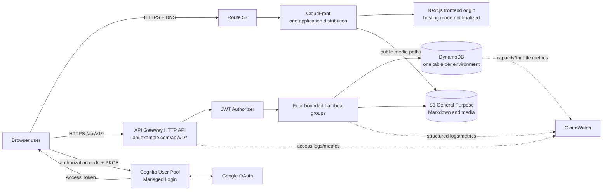
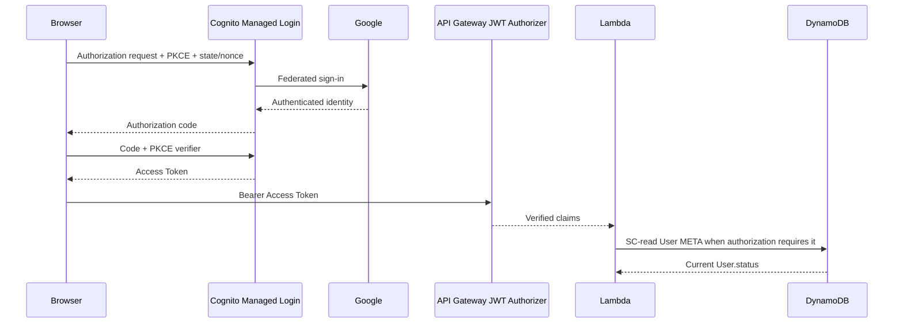
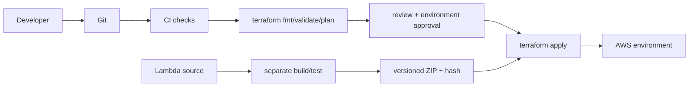

# AWS system architecture V1

## Purpose and status

Tài liệu này chốt **target AWS resource architecture** cho phase triển khai backend/IaC tiếp theo. Repository hiện vẫn là frontend prototype dùng mock data; chưa có backend, Terraform state hay AWS resource nào được triển khai.

Các ranh giới source of truth:

- `DATA_MODEL.md` sở hữu business/domain semantics.
- `DYNAMODB_DESIGN.md` sở hữu physical item mapping, access patterns, transaction và capacity allocation.
- `API_DESIGN.md` sở hữu HTTP routes, DTO, auth classes và error contract.
- Tài liệu này chỉ sở hữu cách các AWS service kết nối, được bảo vệ và vận hành.
- `TERRAFORM_DESIGN.md` sở hữu cách biểu diễn/deploy kiến trúc này bằng Terraform.

Mục tiêu V1 là AWS-native, serverless, dễ học theo AWS SAA, dễ vận hành cho personal technical blog và có cost guardrail rõ. Thiết kế không giả định toàn bộ hệ thống miễn phí.

## System shape



CloudFront is the intended frontend/media front door, but the Next.js compute/origin is deliberately unresolved. The current repository uses App Router, Server Components and client-side interactions, has no `output: "export"`, and must not be constrained to S3 static hosting until SSR/runtime needs and the hosting product are decided.

## API architecture

V1 uses Amazon API Gateway **HTTP API** with the stable base path `/api/v1`. It does not use API Gateway REST API, Next.js Route Handlers as the primary backend, or browser-to-DynamoDB access.

| Layer | V1 responsibility |
| --- | --- |
| API Gateway HTTP API | Method/path routing, JWT authorizer attachment, exact-origin CORS, account/stage throttling, access logs and Lambda proxy integrations |
| JWT Authorizer | Validate Cognito token signature, issuer, audience/client ID, time claims and required access scope |
| Lambda | Input validation, business logic, authorization beyond authentication, DTO mapping, idempotency and DynamoDB/S3 coordination |
| Frontend | Call the API through one client layer; never receive general AWS credentials or persistence keys |

Gateway-native `401`/`429` behavior and Lambda error envelopes remain as specified in `API_DESIGN.md`. Large binary payloads do not pass through API Gateway or Lambda.

## Lambda architecture

V1 deploys exactly four capability-oriented Lambda functions or independently deployable function groups:

| Group | Responsibilities | Main dependencies |
| --- | --- | --- |
| `public-content` | Published Post detail/list, ordered Topic catalog, Topic reads, Series detail/membership reads and S3 Markdown delivery | DynamoDB read paths, S3 content reads |
| `user-profile` | `/me`, Cognito `sub` to application User lookup and idempotent first-use bootstrap | Cognito claims, DynamoDB User/sentinel items |
| `interactions` | Comments, likes, bookmarks, shares, views, counters and idempotency/dedup transactions | DynamoDB interaction/source items |
| `admin-content` | Post/translation CRUD, publish/archive/republish, LabMetadata, Topic/Series management and upload presign | DynamoDB content transactions, S3 content/media operations |

V1 does not create one Lambda per endpoint. Thirty-eight product routes are too fine-grained for a personal project: per-route functions would multiply packaging, IAM, logging, configuration and deployment overhead before traffic justifies independent scaling. Four bounded groups keep ownership and blast radius understandable while still avoiding one broad lambdalith. A group may be split only when measured scaling, deployment isolation or IAM evidence warrants it.

Lambda functions are not placed in a VPC in V1 because all required dependencies expose managed AWS endpoints. This avoids NAT Gateway cost and VPC networking complexity. Timeouts, memory and any reserved concurrency are explicit per group; provisioned concurrency is not enabled without latency evidence and cost review.

## Authentication and authorization



- Cognito User Pool owns authentication, Google federation, managed login and token issuance.
- The browser app client is public, has no client secret and uses authorization code with PKCE. `state` and OIDC `nonce` remain required browser controls.
- Protected `/api/v1/*` routes use the Cognito **Access Token** and the HTTP API JWT authorizer.
- An ADMIN action requires all three checks: valid Access Token, `cognito:groups` contains `ADMIN`, and a strongly consistent DynamoDB read confirms current `User.status == ACTIVE`.
- API Gateway authenticates the token. Lambda owns group/status authorization and all domain rules; `User.role` alone never grants access.
- No Cognito Identity Pool is created. Browser S3 upload uses a narrowly scoped presigned URL from `admin-content`, not general AWS credentials.

Production should use a Cognito custom domain such as `auth.example.com` when the real domain is available. Its ACM certificate is in `us-east-1`, matching the Cognito/CloudFront custom-domain requirement. Dev may use a Cognito prefix domain until DNS is available.

## DynamoDB infrastructure boundary

The full physical contract remains in `DYNAMODB_DESIGN.md`; this document does not redefine item shapes.

| Setting | V1 decision |
| --- | --- |
| Tables | One table per environment |
| Names | `aws-learning-journal-dev`, `aws-learning-journal-prod` |
| Table class/capacity | Standard, `PROVISIONED` |
| Primary key | `PK` String + `SK` String |
| GSIs | Exactly `GSI1_PUBLISHED` and `GSI2_POST_STATUS` |
| TTL | Enabled on Number attribute `expiresAt` |
| Encryption | DynamoDB encryption at rest with AWS owned key |
| Production protection | PITR and deletion protection enabled |
| Development protection | Deletion protection off; PITR optional for cost control |

The initial provisioned allocation stays exactly with the persistence contract: base table `8 RCU / 6 WCU`, GSI1 `6 / 6`, GSI2 `2 / 6`, total `16 RCU / 18 WCU`. Automatic scaling must not silently move this beyond the agreed Free Tier-oriented budget before billing guardrails and observed traffic justify it. CloudWatch capacity/throttle evidence drives any later adjustment or move to on-demand.

## S3 object storage

Each environment gets one private S3 General Purpose content/media bucket. Logical responsibilities are separated by backend-owned prefixes rather than extra buckets in V1:

| Prefix family | Content |
| --- | --- |
| `content/posts/...` | Versioned UTF-8 Markdown bodies and related content objects |
| `media/posts/...` | Cover and inline Post images |
| `media/topics/...` | Topic icon assets |
| `media/users/...` | Avatars |
| `attachments/...` | Explicitly supported Post attachments |

Controls:

- Enable all S3 Block Public Access settings and Bucket owner enforced object ownership.
- Enforce TLS and use S3 server-side encryption. V1 uses SSE-S3 with S3-managed keys unless a later compliance requirement needs customer-managed KMS.
- Enable Versioning in production. Dev versioning may remain off to reduce retained-object cost.
- Limit CORS to the exact environment frontend origin, required `PUT`/`HEAD` methods and required upload headers. Do not use wildcard origins with credentials.
- Backend derives the object key from verified actor, trusted resource ID, upload kind and request identity. The client cannot choose an arbitrary key.
- Persist an S3 object key/version reference, never a temporary presigned URL. Public DTO delivery URLs are derived at read time.
- CloudFront reads publishable media through OAC with signed origin requests. Markdown body remains an API DTO field and is read by `public-content` Lambda from S3 in V1. The bucket policy grants each principal only its required prefixes and grants CloudFront only for the intended distribution ARN.
- Use scoped CloudTrail S3 data events only after a production security/cost review; management events, CloudWatch metrics and access logging remain part of the audit baseline.

Direct upload flow:

```text
Browser
  -> POST /api/v1/admin/uploads
  -> admin-content validates ADMIN, ACTIVE, type, size, checksum and target
  <- short-lived presigned S3 PUT URL + backend-owned object key identity
Browser
  -> PUT binary directly to S3
admin-content
  -> verifies object metadata/checksum and owned prefix before attaching reference
```

S3 and DynamoDB do not share a transaction. The immutable/new S3 version is written first, then the DynamoDB pointer is conditionally updated; an unreferenced failed attachment is an orphan for bounded cleanup, not a reason to overwrite a published object.

## CloudFront and API domain decision

Production V1 chooses:

- `https://example.com` (and optional `www`) -> one CloudFront application distribution -> the eventual Next.js-capable frontend origin.
- Public media paths on the same distribution -> private S3 origin through OAC. Markdown body remains behind the content API.
- `https://api.example.com/api/v1/*` -> API Gateway **Regional HTTP API custom domain**, directly; `/api/*` is not routed through CloudFront in V1.

This keeps frontend and API as separate origins but under the same registrable site, so the `HttpOnly; Secure; SameSite=Lax` view-cookie contract in `API_DESIGN.md` remains valid. It also avoids adding API cache-key, authorization-header, cookie and non-idempotent-method behavior to CloudFront before there is a need. Credentialed API CORS uses exact frontend origins.

Only one persistent application CloudFront distribution is planned for production. Dev uses direct development origins by default and creates an edge distribution only for deliberate Phase 6 testing. Cognito may use an AWS-managed CloudFront distribution behind its custom domain; the application does not create another distribution for it. Routing `/api/*` through the application distribution may be reconsidered only if a proven single-origin, edge control or latency requirement outweighs the operational cost.

CloudFront behavior is conservative:

- Redirect viewer HTTP to HTTPS and attach an appropriate security response headers policy.
- Cache immutable/versioned media aggressively; use object version/key changes instead of routine invalidations.
- Do not cache personalized/authenticated API responses because API traffic bypasses CloudFront.
- Decide HTML/RSC cache behavior only after the Next.js hosting origin is selected; do not assume static export.
- Enable standard access logging only with an explicit destination, retention/lifecycle and cost review; do not enable real-time logs in V1.

## Route 53 and ACM

Route 53 owns the public hosted zone and DNS records once the production domain is known:

| Record | Target |
| --- | --- |
| Apex and optional `www` | Alias to the application CloudFront distribution |
| `api` | Alias to the API Gateway Regional custom domain |
| `auth` | Alias/CNAME to the Cognito custom-domain CloudFront target |
| ACM validation records | DNS validation for the corresponding certificate |

ACM certificate placement is service-specific:

- Viewer certificate for CloudFront: request/import in `us-east-1`.
- Cognito custom-domain certificate: request/import in `us-east-1`.
- API Gateway Regional custom-domain certificate: create in the same AWS Region as the HTTP API.

Terraform therefore needs a primary application-Region AWS provider and an aliased `us-east-1` provider. DNS validation records remain in the authoritative hosted zone even when certificates live in different Regions.

## IAM model

Each Lambda group has its own execution role and pre-created CloudWatch log group. Policies are scoped to the environment table/index ARNs, S3 bucket prefixes, log group and SSM parameter paths; no runtime role receives `Action="*"` or `Resource="*"`.

| Principal | Required access | Explicitly excluded |
| --- | --- | --- |
| `public-content` Lambda | DynamoDB `GetItem`, `BatchGetItem`, `Query` on the environment table and GSI1; S3 `GetObject` on publishable Markdown/media prefixes; read exact runtime config/secret parameter paths | DynamoDB mutations/`Scan`, GSI2, S3 writes, Cognito admin APIs |
| `user-profile` Lambda | DynamoDB strongly consistent reads plus bounded `PutItem`/`UpdateItem`/`TransactWriteItems` for User and uniqueness/bootstrap items; own log group | S3, content/admin writes, table `Scan`, Cognito administration |
| `interactions` Lambda | DynamoDB `GetItem`, `BatchGetItem`, `Query`, conditional item writes and `TransactWriteItems` for interaction/idempotency/counter paths; cursor/view signing parameter reads | S3 writes, content publication, GSI admin listing, Cognito admin APIs |
| `admin-content` Lambda | DynamoDB source/projection reads and bounded conditional/transaction writes on the table plus `Query` on GSI2; S3 `PutObject`-presign authority and `GetObject`/metadata validation on owned content/media prefixes; exact secret/config parameter reads | General bucket administration, arbitrary key writes, table `Scan`, Cognito user/group administration |

IAM cannot express every single-table entity rule solely with an ARN. Where supported, add `dynamodb:LeadingKeys` conditions for stable partition families; application validation and transaction conditions remain mandatory defense in depth. `TransactWriteItems` permission is still scoped to the environment table ARN.

Additional resource policies:

- API Gateway Lambda invoke permissions are scoped by the exact API execution ARN, routes/stage where practical and current environment.
- CloudFront OAC S3 bucket access uses `cloudfront.amazonaws.com`, exact distribution `AWS:SourceArn` and `AWS:SourceAccount` where supported.
- S3 presigned requests inherit `admin-content` permission and remain limited by key prefix, content constraints and short expiry.
- Deployment roles are separate from runtime roles and are defined conceptually in `TERRAFORM_DESIGN.md`.

## Configuration and secrets

| Class | Examples | Storage/distribution |
| --- | --- | --- |
| Non-secret | Table name, bucket name, AWS Region, User Pool ID, App Client ID, API URL, supported locales, log level | Terraform outputs -> environment-specific Lambda/frontend configuration |
| Secret | Google OAuth client secret, cursor HMAC current/previous key, viewer HMAC key, future signing secrets | SSM Parameter Store `SecureString` under an environment path; Lambda reads only exact required parameters at runtime |

Parameter Store Standard-tier `SecureString` is the V1 default because these are small, low-rotation secrets for a low-cost personal application. Secrets Manager is deferred until automatic rotation, a database credential integration or richer secret lifecycle is required.

Never place secret plaintext in committed `tfvars`, Terraform source, Lambda source, frontend environment variables, build logs or the Git repository. Frontend configuration may contain public Cognito IDs and endpoints, but never the Google secret or server signing keys. Terraform's special secret-state boundary is documented in `TERRAFORM_DESIGN.md`.

## CloudWatch observability

| Surface | Metrics/logs |
| --- | --- |
| Lambda | Invocations, Errors/error rate, Duration p99, Throttles, ConcurrentExecutions where bounded; structured JSON logs |
| API Gateway HTTP API | Request count, `4XX`, `5XX`, integration latency/latency and throttling indicators; structured access logs |
| DynamoDB | Consumed versus provisioned RCU/WCU, `ReadThrottleEvents`, `WriteThrottleEvents`, system errors |
| S3/CloudFront | Basic request/error metrics first; detailed/real-time logs only when their diagnostic value justifies cost |

Every request carries the API Gateway request ID into Lambda logs and the API response error `requestId`. Application-generated correlation IDs may be accepted/generated but must never replace the trusted gateway request ID. Logs exclude JWTs, authorization headers, cookies, raw HMAC inputs/digests, presigned query strings, secret values and unnecessary personal data.

Log groups are created explicitly with retention: initially 7 days in dev and 30 days in prod, then adjusted from evidence. Production starts with a small, non-noisy alarm set:

- Lambda error-rate and throttle alarms using multi-datapoint evaluation; duration p99 starts as dashboard evidence until a baseline exists.
- API Gateway `5XX` alarm; `4XX` is dashboarded first because normal auth/input failures can be noisy.
- DynamoDB read/write throttle alarms and a sustained consumed/provisioned capacity warning.
- Budget notifications are separate from availability alarms.

No custom high-cardinality metric dimensions, anomaly detection, real-time logs, Lambda Insights or full tracing are enabled by default. Add them after an incident/debugging need or cost review.

## Cost guardrails

- DynamoDB uses the provisioned `16 RCU / 18 WCU` initial total already defined by `DYNAMODB_DESIGN.md`; do not enable unbounded auto scaling.
- Lambda and API Gateway HTTP API are pay-per-use; no provisioned concurrency is enabled initially.
- Cognito cost depends on active users and optional feature plans. V1 does not enable paid threat-protection features without a separate requirement and pricing review.
- S3 charges include storage, requests, retained versions and transfer. Add lifecycle rules only after real retention/access evidence; always bound incomplete multipart uploads and old versions when versioning is enabled.
- CloudWatch ingestion, retained logs, custom metrics and alarms can accumulate cost, so retention and metric cardinality are explicit.
- Route 53 hosted zones/domain registration are fixed or recurring costs outside compute request volume.
- DynamoDB PITR, S3 versions, CloudFront requests/data transfer and origin traffic can add cost.
- No VPC/NAT Gateway, OpenSearch, RDS, DAX or Redis is part of V1.

Create an account-level monthly AWS Cost Budget with actual notifications at `$1`, `$5` and `$10`, plus a forecasted notification where AWS has enough data. Alerts are guardrails, not real-time circuit breakers. A tag-filtered application view may supplement but not replace the account budget because not every charge is taggable.

AWS pricing and Free Tier eligibility depend on Region, payer account and account plan and can change. Recheck current service pricing, the account's Free Tier plan/usage and budget notification behavior immediately before deployment; this architecture is **not guaranteed free**.

## Environments and naming

V1 has only `dev` and `prod`. Resource names use:

```text
<app>-<resource>-<environment>
```

Examples: `aws-learning-journal-api-dev`, `aws-learning-journal-public-content-dev`, `aws-learning-journal-content-prod`.

Both environments have separate API, Lambdas/configuration, Cognito app clients, DynamoDB tables, S3 buckets/prefix policies, log groups and Terraform state. IAM policies name exact environment ARNs; Lambda environment variables are generated from same-environment Terraform outputs. CI roles cannot apply prod from a dev job. Local tests do not create production resources.

Minimum tags are `Application=aws-learning-journal`, `Environment=dev|prod` and `ManagedBy=Terraform`; add `Owner=khanh` only where the repository/account convention needs it.

## Deployment flow



Lambda compilation/package creation happens before Terraform. Terraform deploys a prepared artifact and content hash; it is not the application build system. Prod applies require review/manual approval. Frontend build/hosting deployment is a separate pipeline until its runtime/origin is selected; infrastructure must not silently force static export.

## Failure boundaries

| Failure | V1 behavior |
| --- | --- |
| API Gateway unavailable/misconfigured | All API calls fail before Lambda; frontend can keep already-rendered/cacheable content but must show a bounded retry/error state |
| Lambda error/timeout/throttle | Only routes owned by that capability group are affected; API returns the documented safe error, logs correlate by request ID |
| DynamoDB throttle/unavailable | Backend uses bounded SDK retries and fails closed; writes are not partially emulated outside documented transactions |
| S3 read/upload failure | Structured metadata may remain available, but body/media/upload fails independently; DynamoDB pointer is not advanced after a failed validation/attach |
| Cognito unavailable | New login/token refresh and protected requests can fail; public routes remain independent, while admin operations fail closed |

No custom active-active or complex HA layer is added. API Gateway, Lambda, DynamoDB, S3, Cognito and CloudFront already provide managed service resilience within their documented service boundaries.

## Security baseline

- TLS for viewer, API and AWS service communication; redirect frontend HTTP to HTTPS.
- One least-privilege runtime role per Lambda group and separate deployment roles.
- S3 Block Public Access, Bucket owner enforced, encryption at rest and CloudFront OAC.
- Cognito JWT authorizer plus Lambda `token_use`, ADMIN group and current ACTIVE checks.
- Exact credentialed CORS origins; input validation and server-owned S3 keys.
- No AWS long-lived credentials in application/frontend or CI; no Identity Pool.
- No secrets in frontend, source, committed variables, logs or error responses.
- Structured safe logging, explicit retention and protected log access.
- Environment-specific identifiers, state and policies; production DynamoDB deletion protection/PITR and S3 Versioning.
- Dependencies and Lambda artifacts are reproducible, scanned in CI when that workflow is introduced, and deployed by hash.

## Deferred decisions

V1 explicitly defers AWS WAF, Shield Advanced subscription, multi-Region deployment, DynamoDB Global Tables, Lambda@Edge, OpenSearch, DAX, Redis/ElastiCache, EventBridge workflows, Step Functions, Kinesis, complex DR and active-active architecture. It also defers frontend hosting/origin selection, public Series catalog AP22 and Practice backend APIs.

WAF may be reconsidered when abuse/attack evidence, public launch risk or compliance warrants its fixed/variable cost. AWS Shield Standard remains the AWS-provided baseline for eligible resources; no paid Shield Advanced subscription is planned.

## Final V1 architecture decisions

| Concern | Authoritative V1 choice |
| --- | --- |
| Frontend | Next.js; hosting/runtime origin not finalized and not assumed static-only |
| API | API Gateway HTTP API at `/api/v1/*` |
| API domain | Regional `api.example.com`, same-site with frontend; no CloudFront `/api/*` behavior |
| Compute | Exactly four bounded Lambda capability groups |
| Authentication | Cognito User Pool Managed Login + Google, authorization code with PKCE |
| Authorization | JWT authorizer; Lambda enforces access token/group/business rules and SC ACTIVE check |
| Database | One DynamoDB Standard PROVISIONED table/environment with exactly two GSIs |
| Object storage | One private S3 content/media bucket/environment, backend-owned keys, direct presigned upload |
| CDN/front door | One application CloudFront distribution, S3 OAC, frontend origin deferred |
| DNS/TLS | Route 53 + ACM; CloudFront/Cognito certs in `us-east-1`, API cert in API Region |
| Monitoring | CloudWatch metrics, structured logs, explicit retention and small alarm set |
| Secrets | SSM Parameter Store SecureString by default |
| IaC | Terraform with isolated dev/prod state and reviewed plan/apply workflow |

## Authoritative references

- [API Gateway HTTP APIs](https://docs.aws.amazon.com/apigateway/latest/developerguide/http-api.html)
- [HTTP API JWT authorizers](https://docs.aws.amazon.com/apigateway/latest/developerguide/http-api-jwt-authorizer.html)
- [HTTP API custom domains](https://docs.aws.amazon.com/apigateway/latest/developerguide/http-api-custom-domain-names.html)
- [Regional API custom-domain certificates](https://docs.aws.amazon.com/apigateway/latest/developerguide/apigateway-regional-api-custom-domain-create.html)
- [Cognito Managed Login/OAuth endpoints](https://docs.aws.amazon.com/cognito/latest/developerguide/cognito-userpools-server-contract-reference.html)
- [CloudFront certificate requirements](https://docs.aws.amazon.com/AmazonCloudFront/latest/DeveloperGuide/cnames-and-https-requirements.html)
- [CloudFront OAC for S3](https://docs.aws.amazon.com/AmazonCloudFront/latest/DeveloperGuide/private-content-restricting-access-to-s3.html)
- [S3 security best practices](https://docs.aws.amazon.com/AmazonS3/latest/userguide/security-best-practices.html)
- [DynamoDB point-in-time recovery](https://docs.aws.amazon.com/amazondynamodb/latest/developerguide/Point-in-time-recovery.html)
- [AWS IAM best practices](https://docs.aws.amazon.com/IAM/latest/UserGuide/best-practices.html)
